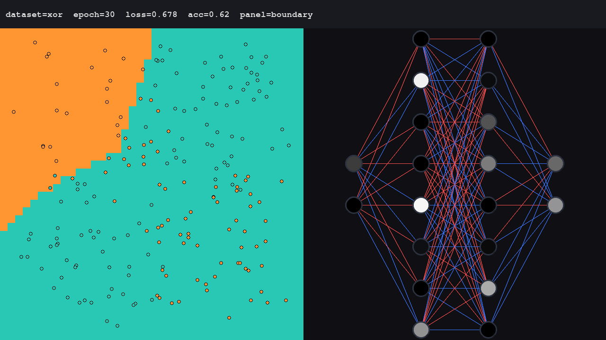
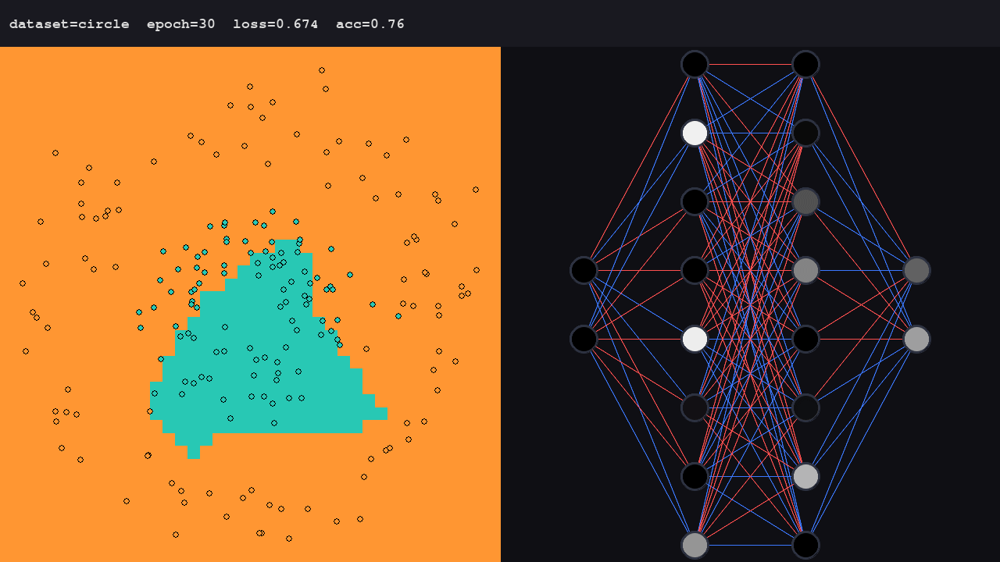
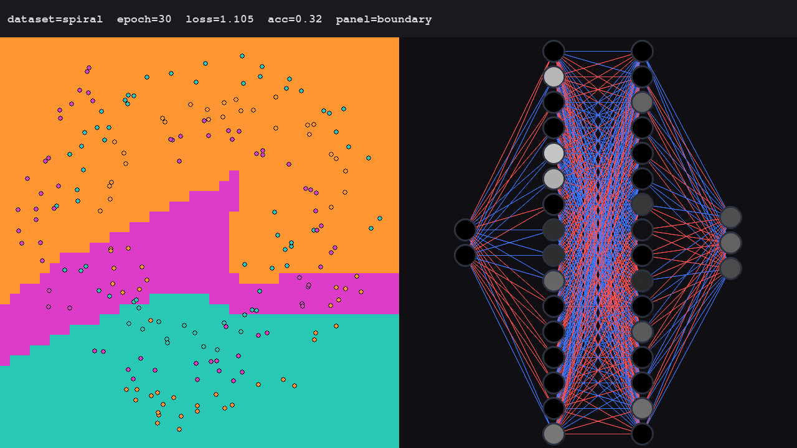

# neural-network

Feedforward neural network, REINFORCE policy gradient, and decoder-only
transformer — all from scratch in **numpy**, with a **pygame** visualizer
that animates decision boundaries, weight graphs, the MountainCar
environment, and multi-head attention.

**v1 (shipped v0.1.0)** — three toy datasets (**XOR**, **circle**,
**spiral**) trained via backprop. Makes the gradient visible: every
component is ~100 lines, weights update in real time, no deep-learning
frameworks hiding autograd.

**v2 (shipped v0.2.0)** — **MountainCar-v0** with REINFORCE (constant
baseline) + **decoder-only transformer** from scratch (~600K params,
char-level Shakespeare). Same educational ethos: every line readable,
every gradient computable by hand.

The project exists to make learning **visible** — at every scale, from
a 2-layer feedforward to a multi-head attention block.

## Visual

### v1 — feedforward datasets (decision boundary + weight graph)

The visualizer shows two panels side-by-side:

- **Left**: a 40×40 decision boundary grid. Each cell is colored by
  the predicted class for that input. Dataset points are overlaid as
  small circles.
- **Right**: a weight graph. Nodes are circles filled by activation
  (white = full, black = zero), connections are lines **blue for
  negative weight, red for positive**, thickness by |weight|.

| XOR | Circle | Spiral |
| :-: | :-: | :-: |
|  |  |  |

Each GIF is 120 frames at 20fps (6s loop). Watch the decision boundary
on the left deform as the loss falls, and the weight graph on the
right shift colors.

### v2 — MountainCar + Transformer

The visualizer grows two new panels (right side only — left side stays
empty for the new modes):

- **MountainCar (`key 4`)**: left panel shows the live policy rollout
  in the actual gym environment (gymnasium's `MountainCar-v0`).
  The car learns to swing up the hill via REINFORCE with constant
  baseline.
- **Transformer (`key 5`)**: left panel shows a multi-head attention
  heatmap (dark blue = low attention, yellow = mid, red = high).
  The right panel keeps the weight graph.

## Quick start

```bash
# 1. Install deps (v1 only needs numpy + pygame; v2 also pulls gymnasium)
pip install -r requirements.txt

# 2. Verify the math (headless, <10s) — all 12 test files
python3 -m tests.test_nn            # v1 feedforward
python3 -m tests.test_layers        # v2 building blocks
python3 -m tests.test_attention     # v2 multi-head attention
# ... (test_layers, test_modules, test_optim, test_attention,
#  test_rollout, test_transformer, test_rl, test_train,
#  test_visualizer, test_visualizer_v2, test_main — 67 asserts total)

# 3. Run the visualizer (needs a display) — default is XOR
python3 main.py

# 4. v1 datasets: pass --dataset explicitly
python3 main.py --dataset circle
python3 main.py --dataset spiral

# 5. v2 tasks: press keys 4 or 5 inside the visualizer (or pass --task)
python3 main.py --task mountaincar  # REINFORCE on MountainCar-v0
python3 main.py --task transformer  # decoder-only transformer, bundled Shakespeare
```

## Key bindings

### Global

| Key       | Action                                                    |
|-----------|-----------------------------------------------------------|
| `1` `2` `3` | Switch to v1 task (xor / circle / spiral). Resets weights. |
| `4` `5`   | Switch to v2 task (MountainCar / Transformer).            |
| `ESC`     | Quit.                                                     |
| `TAB`     | (v1 only) Cycle right panel: boundary � weight graph.       |

### v1 tasks (xor / circle / spiral)

| Key       | Action                                                    |
|-----------|-----------------------------------------------------------|
| `SPACE`   | Pause / resume training.                                  |
| `R`       | Reset weights (same seed), restart training.              |
| `+` / `-` | Adjust learning rate (1.5× steps, clamped 0.001–1.0).    |
| `F`       | Toggle fast-forward (10 → 200 epochs/frame).              |
| **click** | Click an input node to toggle its value (0 ↔ 1). Pauses.  |

### v2 tasks

MountainCar and Transformer have no extra key bindings beyond task
switching. The right panel auto-renders the relevant view (gym frame
or attention heatmap).

## CLI options

```
python3 main.py --task xor|circle|spiral|mountaincar|transformer
                 --epochs 2000          # not enforced; training runs continuously
                 --lr 0.05              # initial learning rate (v1)
                 --arch 2,8,8,3         # layer sizes (v1; default matches spec)
```

`--task` selects which of the 5 tasks runs at startup. Inside the
visualizer, keys `1`–`5` switch between them live.

## Headless smoke test

If you can't open a display (CI, LXC, SSH without X11):

```bash
SDL_VIDEODRIVER=dummy python3 main.py --task xor --epochs 5
SDL_VIDEODRIVER=dummy python3 main.py --task mountaincar
SDL_VIDEODRIVER=dummy python3 main.py --task transformer
```

Each one initializes pygame under the `dummy` SDL driver, runs the
loop for a few seconds, and exits 0. Use these to confirm the project
works on a fresh machine without a display.

## File layout

```
neural-network/
├── nn.py              # v1 NeuralNetwork class (numpy-only, ~115 LOC) — FROZEN
├── datasets.py        # v1 xor / circle / spiral generators (~70 LOC) — FROZEN
├── visualizer.py      # pygame render: v1 boundary/weight + v2 gym/attention panels
├── main.py            # CLI loop with task registry (5 tasks) + key + click controls
├── sanity.py          # v1 one-shot smoke check for nn.py
├── layers.py          # v2 building blocks (Linear, ReLU, Tanh, Sigmoid, Softmax, LayerNorm)
├── modules.py         # v2 Residual wrapper
├── optim.py           # v2 AdamW (decoupled weight decay, bias correction)
├── envs/              # v2 MountainCar wrapper + rollout batch collector
├── transformer/       # v2 attention, block, model, train (AdamW + checkpoint)
│   └── attention.py
│   └── block.py
│   └── embed.py
│   └── model.py
│   └── train.py
├── data/              # v2 char-level text loader + bundled Shakespeare
├── train_rl.py        # v2 REINFORCE trainer with constant baseline
├── tests/             # 12 test files, 67 asserts total (see below)
│   ├── test_nn.py            # v1: 3 datasets, acc thresholds
│   ├── test_layers.py        # v2: Linear/ReLU/Tanh/Sigmoid/Softmax + finite-diff
│   ├── test_modules.py       # v2: LayerNorm + Residual
│   ├── test_optim.py         # v2: AdamW (bias correction, decoupled WD)
│   ├── test_attention.py     # v2: MHA causal mask + multi-head split + FD
│   ├── test_rollout.py       # v2: MountainCar env + rollout shape
│   ├── test_transformer.py   # v2: Transformer forward/backward + sample + loss drop
│   ├── test_rl.py            # v2: REINFORCE gradient + baseline invariance
│   ├── test_train.py         # v2: AdamW trainer + checkpoint round-trip + auto-load
│   ├── test_visualizer.py    # v2: refactored update(metrics, panel) + set_panel
│   ├── test_visualizer_v2.py # v2: gym_render + attention panels
│   └── test_main.py          # v2: task registry + 5 keys under dummy SDL
├── docs/
│   ├── agents/        # engineering-skill config
│   └── adr/           # architecture decision records
├── .scratch/          # local-markdown issues (see docs/agents/issue-tracker.md)
├── requirements.txt
├── AGENTS.md          # agent entry point
└── CONTEXT.md         # project context (loaded on every session)
```

## Architecture

### v1 (frozen since v0.1.0)

| Module          | Responsibility                                        |
|-----------------|-------------------------------------------------------|
| `nn.py`         | Single seam: `NeuralNetwork.forward/backward/fit`. No deps beyond numpy. |
| `datasets.py`   | Three 2D generators, all return `(X, y)` with `X ∈ [-1, 1]²`. |
| `visualizer.py` | Render-only. Caller drives training and calls `update()` per frame. (v2 panels added later via metrics-dict API.) |
| `main.py`       | Glue: argparse, 60fps loop, key/mouse handlers. (v2 added task registry + keys 4/5.) |
| `tests/test_nn.py` | Stdlib-only validation: 3 datasets, acc thresholds.   |

### v2 (built alongside v1 — no v1 modifications)

| Module              | Responsibility                                  |
|---------------------|-------------------------------------------------|
| `layers.py`         | Building blocks: Linear (Xavier init), ReLU, Tanh, Sigmoid, Softmax, LayerNorm. Each has `forward`/`backward` symmetric; in-place SGD with `lr=1.0` (caller scales). |
| `modules.py`        | `Residual(fn)` — splits grad between fn path and identity path. |
| `optim.py`          | `AdamW(params, lr=3e-4, betas=(0.9, 0.95), weight_decay=0.1)` — decoupled weight decay (Loshchilov & Hutter) + bias correction. |
| `envs/mountaincar.py` | `MountainCarEnv` wraps gymnasium `MountainCar-v0`, normalizes obs to [-1, 1]², returns RGB render frames. |
| `envs/rollout.py`   | `RolloutBatch` dataclass + `rollout(env, policy_fn, n_episodes)` collector. |
| `train_rl.py`       | REINFORCE trainer with constant baseline. Returns updated policy + mean episode reward. |
| `transformer/attention.py` | `MultiHeadAttention(d_model, n_heads)` with strict-causal mask + multi-head split/concat. |
| `transformer/block.py` | Pre-norm transformer block: `x = x + MHA(LN(x))`, `x = x + FFN(LN(x))`. |
| `transformer/embed.py` | `Embedding(vocab, d_model)` + sinusoidal `PositionalEncoding`. |
| `transformer/model.py` | `Transformer(vocab, d_model, n_heads, n_layers, d_ff, max_seq_len)` — embedding + pos enc + N blocks + final LN + LM head + autoregressive `sample()`. |
| `transformer/train.py` | `Trainer(model, data, lr)` with AdamW + checkpoint round-trip + auto-load from CWD on init. |
| `data/text.py`     | Char-level loader (uint8 byte stream, vocab=256). Bundled clean Shakespeare excerpt (~1.5KB) at `data/shakespeare.txt`. |
| `main.py` TASKS    | 5 task classes registered: `XorTask`, `CircleTask`, `SpiralTask` (wrap v1 logic), `MountainCarTask` (REINFORCE on gym env), `TransformerTask` (AdamW + bundled Shakespeare). Dispatched by keys 1–5. |
| `tests/test_*.py` (12 files) | 67 asserts total; each module has its own seam-tested test file. |

### Conventions

- All modules follow the **forward/backward symmetric** convention:
  `forward(x)` returns output and caches input; `backward(grad)`
  returns input grad and (for params) updates W/b in-place with
  `lr=1.0` (caller scales). `update=False` flag suppresses the
  in-place step when an external optimizer (AdamW) drives the update.
- **Frozen files throughout v2** (`nn.py`, `datasets.py`,
  `tests/test_nn.py`): verified 0 diff lines per merge.

## How learning works here

### v1 — Backprop through a feedforward net

Cross-entropy + softmax fuses into a clean `δ = � - y` gradient at
the output layer. Hidden layers propagate via the chain rule:
`prev.δ = (Wᵀ · layer.δ) ⊙ σ'(prev.z)`. Xavier init keeps activations
sane at start. Full-batch SGD — swap to minibatch if you scale past
~10k samples.

### v2 — REINFORCE policy gradient

For MountainCar, the policy is `π(a|s) = softmax(Linear₂(ReLU(Linear₁(s))))`.
Per episode: collect `(states, actions, rewards, log_probs)` via
`RolloutBatch`. Compute discounted returns `G_t = Σ γ^k r_{t+k}` per
episode. Subtract constant baseline `b = mean(G)` for variance
reduction. Policy gradient loss:
`L = -mean(log π(a|s) · (G_t - b))`. Backprop through softmax +
log-likelihood uses the JVP form `d_logits = (probs - one_hot) · adv / N`
(fused softmax+CE identity, no generic Jacobian).

### v2 — Transformer block (pre-norm)

For each block in the N-block stack:
- `x = x + MHA(LayerNorm(x))` — self-attention with causal mask
- `x = x + FFN(LayerNorm(x))` where `FFN = Linear → ReLU → Linear`

Self-attention: `Q, K, V = x @ W_{q,k,v}` (per head via `_split_heads`);
`scores = Q @ K.T / sqrt(d_k)`; causal mask via `scores += upper-tri
-inf`; `weights = softmax(scores)`; `out = weights @ V`. Concat heads,
project via `W_o`. The gradient for `softmax + log π` is the same
fused identity as REINFORCE (and as cross-entropy in v1).

Training: AdamW with `lr=3e-4`, `betas=(0.9, 0.95)`, `weight_decay=0.1`
(decoupled — applied to data before moments, not added to grad). Bias
correction handles the first few steps. Checkpoint round-trip via
`npz` (all params + step count); auto-loads from `checkpoint.npz`
in CWD on `Trainer(...)` construction.

## Limitations

### v1
- Full-batch SGD, no momentum, no Adam. Fine for toy datasets, slow
  for anything bigger.
- Cross-entropy loss only. Regression with sigmoid+CE has a latent
  bug (TODO in code, not exercised).
- Reproducible: seed `42` hardcoded in `NeuralNetwork.__init__`. Add
  a `seed=` parameter if you need to vary runs.
- Visualizer is fixed 1280×720. Resize requires code change.
- No save/load weights, no checkpointing, no video capture.

### v2
- Char-level tokenization only (vocab=256 ASCII bytes). No BPE /
  SentencePiece — adds dep + learning curve without changing the
  math. Adding BPE later is a drop-in tokenizer swap.
- MountainCar reward shaping off (uses gymnasium's default per-step
  -1 + +100 on goal). REINFORCE variance reduction = constant
  baseline only; no GAE, no entropy bonus.
- Transformer trained on bundled ~1.5KB Shakespeare excerpt (smoke
  data). For real training, swap in a larger corpus via
  `data.text.load_text(path)`.
- KV-cache not implemented: `sample()` recomputes full attention
  each step. Fine at `seq_len=128`; swap to KV-cache for longer.
- Distributed / mixed-precision / flash-attention: not implemented.
- AdamW biases stored only in optimizer state, not in checkpoint.
  Restoring a checkpoint resumes step counter but biases start at 0.
- `MountainCar-v0` and `Transformer` visualizers reuse the right
  panel only; the left panel is empty in those modes (no side-by-side
  comparison with the v1 weight graph).

## What's next

- **v2 (shipped v0.2.0)** — `MountainCar-v0` with REINFORCE (constant
  baseline) + a decoder-only transformer from scratch (~600K params,
  char-level Shakespeare). Press `4` for MountainCar or `5` for the
  transformer visualizer. See release notes for `v0.2.0`.
- **v3 (planned)** — diffusion model from scratch (3Blue1Brown
  chapter 10). Depends on v2's transformer modules + interpretability
  tools. Spec not yet drafted.

## See also

- `CONTEXT.md` — project context, loaded every session
- `docs/agents/issue-tracker.md` — how issues are tracked
- `docs/adr/` — architecture decision records
- `neural-networks-foundation` skill — chapter-by-chapter notes from
  3Blue1Brown + Coding Train